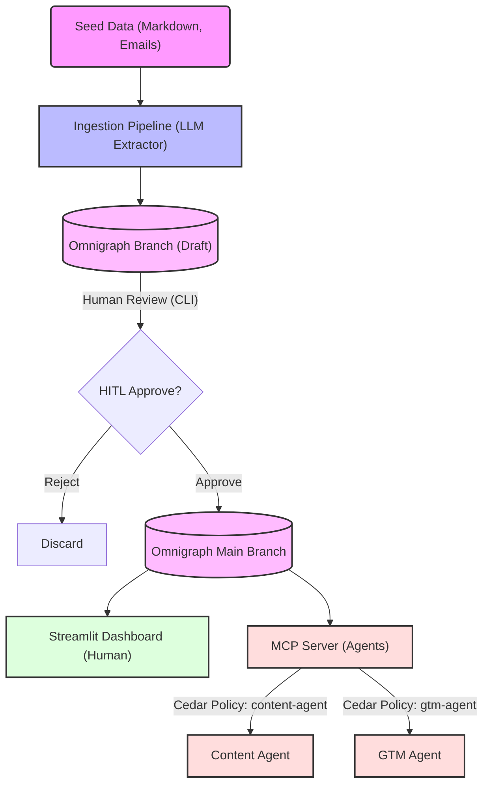

# Analytos Org Context Layer (Analytos Brain)

This repository is a Proof-of-Concept (POC) for a governed, single-source-of-truth context layer for Analytos. It leverages Omnigraph concepts to ingest, govern, and distribute organizational knowledge to both humans and LLM agents securely using Cedar policies.

## 🌟 Architecture & Flow Diagram

The entire pipeline supports a Human-in-the-Loop (HITL) system to ensure agents and employees only read trusted, verified information.



### Components overview:
1. **Omnigraph Setup**: Configured nodes (`Product`, `Feature`, `Persona`, etc.) and constraints using `.pg` and `.gq` files located in the `config/` directory.
2. **Ingestion Pipeline**: Parses unstructured text/markdown and converts it into a typed Knowledge Graph using LLM feature extraction routines (`backend/ingest.py`). 
3. **HITL Review**: Provides a diff between the current `main` graph and the isolated `draft` branch. Allows a human administrator to interactively approve or reject graph mutations.
4. **Dashboard**: A basic web UI (`streamlit`) allowing humans to browse the knowledge graph and search across it.
5. **MCP Server**: Role-Based Access Control logic enforcing Cedar policies on a Context Layer toolset. Agents interact securely with it.

---

## 🚀 Setup Instructions

1. **Clone the repository and enter the directory**:
   ```bash
   git clone https://github.com/Vasanthq121/Analytos-Org-Context-Layer-data-science---Analytos-Brain.git
   cd Analytos-Org-Context-Layer-data-science---Analytos-Brain
   ```

2. **Create and activate a virtual environment**:
   ```bash
   python -m venv venv
   source venv/bin/activate  # On Windows use: venv\Scripts\activate
   ```

3. **Install Dependencies**:
   ```bash
   pip install google-genai python-dotenv streamlit mcp
   ```

4. **Environment Configuration**:
   Create a `.env` file in the root of the directory and place your Gemini API Key in it since the Ingestion LLM and Agents rely directly on it.
   ```
   GEMINI_API_KEY=your_key_here
   ```

---

## 💻 How to Run the End-to-End Pipeline

### 1. Ingest Data (Simulates `branch` creation)
Run the ingestion pipeline to parse the seed data and extract context.
```bash
python backend/ingest.py
```
> **Output:** Creates `graph_output.json` (the simulated "draft" graph).

### 2. Human-In-The-Loop Approval (Merge into `main`)
Review the new nodes and relationships. Enter `y` to approve and merge them to the main Knowledge Graph.
```bash
cd backend
python review.py
```
*(You can use `echo y | python review.py` to auto-approve).*
> **Output:** Creates `graph_main.json` serving as the main source-of-truth.

### 3. Open the Dashboard (Read layer for Humans)
Start the Streamlit dashboard to visually inspect the entities, relationships, recent changes, and run queries.
```bash
streamlit run backend/dashboard.py
```

### 4. Agent Use Cases (Read layer for AI)
To simulate the MCP Server routing roles securely and the LLMs drafting contextualized output, run these scripts from the project root:

**Run the Content Agent** (Blocked from seeing internal email threads by Cedar Policy):
```bash
python backend/agent/content_agent.py
```

**Run the GTM Prospecting Agent**:
```bash
python backend/agent/gtm_agent.py
```
